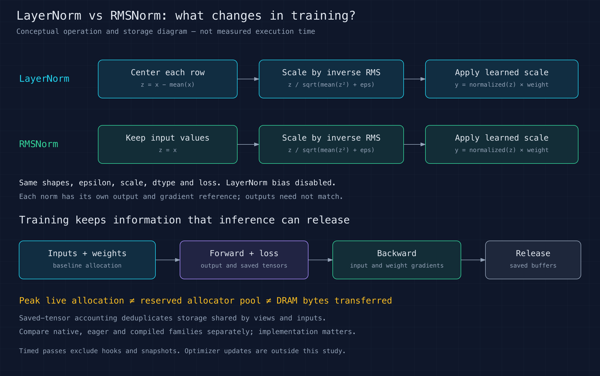

# LayerNorm vs RMSNorm: training runtime and memory overhead

Status: **harness implemented; GPU pilot and sustained measurements pending**.
“Overlaying” means displaying both methods on the same chart with shared axes,
not running the two operations concurrently.

Question: how do the two normalization operations differ in runtime, live GPU
allocation, temporary allocation overhead, saved activations, backward-pass costs, and memory traffic?



[SVG diagram](diagram/theory.svg)

## Implemented protocol and reproduction

The first measured study covers allocator memory, saved storage and timing.
Actual DRAM traffic and fine-grained allocation-lifetime traces remain separate
profiling follow-ups; synchronized stage snapshots are not a time trace.

[standard.json](configs/standard.json) specifies 24 shape/dtype combinations,
two norms, three implementation families and two fresh-process repeats: 288 case
processes. Each case measures inference, training forward, backward on a retained
graph, and a complete forward/loss/backward step. Each mode requires at least
1,000 timed blocks AND 3 measured wall seconds. A calibrated fixed batch targets
3 ms per sample. The total measured-wall floor is 57.6 minutes, plus setup,
compilation, checks, calibration and instrumentation.

Run with the same CUDA/PyTorch environment as inference-lab's kernel exercise
(Python 3.12, PyTorch 2.13.0+cu130, Triton 3.7.1), plus NumPy and Matplotlib:

```bash
python src/benchmark.py --config configs/smoke.json --out local/smoke1
python analysis/report.py local/smoke1 --out local/smoke1-report
python src/benchmark.py --config configs/standard.json --out local/standard1
python analysis/report.py local/standard1 --out local/standard1-report
```

Directories must be new. Copy reviewed compact reports into `results/` only after
auditing raw samples, inspecting visuals and scanning for secrets. Source and
configuration hashes identify each run. Case and mode order are deterministically
shuffled; all workers run sequentially on one GPU. The smoke grid includes the
largest shape but uses short samples, so it is not a performance result.

Both CUDA-event and wall intervals surround ordinary Python-call batches. Event
intervals can include GPU starvation between launches; they are not isolated
kernel latency. The wall interval includes event-recording and end-synchronization
costs. The two timing modes are views of the same batches and must not be added
together. Backward-only retains a fixed graph; full-step creates a new graph and
clears gradients to `None` each call. Training-forward excludes the loss.

The fixed loss is a sum of FP32 output values times fixed random upstream weights
scaled by the square root of the element count. Input and scale gradients are
checked against FP64 autograd on the corresponding normalization formula. Tests
also verify finite values and input immutability. Native precision details can
differ from the eager/compiled FP32 formulas; dtype tolerances are explicit.

Each norm/family/shape/repeat has a fresh process. Memory snapshots follow timing,
with warmed code and an existing allocator pool; baseline includes persistent
input, weight and upstream-gradient tensors. Inference retains its output;
training retains output and loss through backward. Saved-tensor hooks observe
normalization alone and deduplicate storage, reporting both total saved storage
and storage beyond aliases of the input/weight. First inference-plus-training
setup peaks are recorded separately, with persistent compiler caches explicitly
acknowledged. No optimizer state is allocated or measured.

## Fair comparison

Use the same input shape, dtype, epsilon, device, input values and learned scale.
Disable LayerNorm bias for the primary comparison so both operations have one
scale parameter. Normalize the last dimension; measure both a forward-only inference control and a training pass consisting of
forward, a fixed scalar loss, and backward. Use contiguous inputs and no residual
addition initially. If a residual is added later, give
both methods the same residual-rounding contract.

LayerNorm subtracts the row mean and divides by the square root of the row
variance plus epsilon. RMSNorm divides by the square root of the mean square
plus epsilon, without centering. Their outputs are **not expected to match**.
Validate each against its own FP64 oracle. This exercise measures implementation
costs; it does not establish model-quality equivalence or drop-in interchangeability.

Compare three implementation families separately: native PyTorch normalization,
eager formulas, and compiled formulas. A fused custom-kernel comparison can follow.
Do not attribute a difference between an unfused eager formula and a native fused
operator solely to the choice of normalization mathematics.

## Training scope

Measure forward latency, backward latency and complete forward/loss/backward time
separately. Use the same scalar-loss definition and gradient-buffer policy for both
normalizations. Verify input and scale gradients against each operation's own
high-precision reference. Report gradient storage separately from temporary
activations; optimizer state and optimizer updates are excluded from the first study.

Use saved-tensor hooks only in separate instrumented captures to record saved
activation metadata. Deduplicate shared storage when calculating footprint, avoid
retaining additional tensor references, and do not use instrumented timings as
performance measurements. Report actual peak live allocation as a separate metric.

## Planned measurements

| Measurement | Method / interpretation |
| --- | --- |
| GPU execution and Python wall time | Warm steady-state distributions, compilation excluded |
| Input, scale and output footprint | Tensor byte counts with the output retained |
| Peak allocated memory above baseline | CUDA allocator peak after resetting statistics |
| Temporary allocation estimate | Peak increment minus retained output bytes; allocator-visible estimate |
| Reserved memory | Report separately: the allocator pool is not the same as live tensors |
| Saved activations and gradients | Separate training captures; deduplicated storage and explicit gradient-buffer policy |
| Actual GPU memory traffic | Separate Nsight Compute capture; bytes moved are not allocation footprint |
| Allocation lifetime | Separate instrumented memory trace; never use its timings as benchmark latency |

Measure cold setup/compilation memory separately from warmed execution. Run memory
cases in fresh subprocesses to avoid comparing allocator pools left by different
operators. After warmup and synchronization, establish the live-allocation baseline,
reset peak statistics, run the operation, retain its output, synchronize, and
collect peak/current allocated and reserved bytes. State that external CUDA-library
allocations may not be visible to PyTorch's allocator statistics.

Start with rows 1, 32, 512 and 4096; widths 1024, 4096 and 8192; BF16 and FP32.
Specify epsilon explicitly instead of relying on different defaults. Freeze seeds,
versions, shapes and sampling rules before collecting results. Use long runs and
repeated independent passes, numerical checks and independently audited summaries.

## Planned overlays

- Latency versus row width, with both normalizations on the same axes.
- Peak allocated bytes and temporary overhead versus tensor size, with explicit units.
- Saved activation and gradient memory, with forward-only and training curves clearly labeled.
- Allocation timelines over aligned execution windows, labeled as instrumented captures.
- Nsight kernel timelines where helpful; these are separate from the shared-axis chart overlays.

Use identical axes and distinguish native/eager/compiled implementations. Include
SVG and PNG versions and embed the measured charts here. Keep raw profiler traces,
allocator snapshots and machine-specific logs in ignored local storage.

Dependencies: the shared CUDA/PyTorch environment from
[the inference-lab kernel-fusion exercise](https://github.com/rjohnt/inference-lab/tree/main/exercises/04_kernel_fusion) and the profiler tooling from
[the inference-lab data-movement exercise](https://github.com/rjohnt/inference-lab/tree/main/exercises/01_data_movement).

Reference: [PyTorch CUDA memory statistics](https://docs.pytorch.org/docs/stable/cuda.html) and [normalization implementations](https://github.com/pytorch/pytorch/blob/main/torch/nn/modules/normalization.py).
