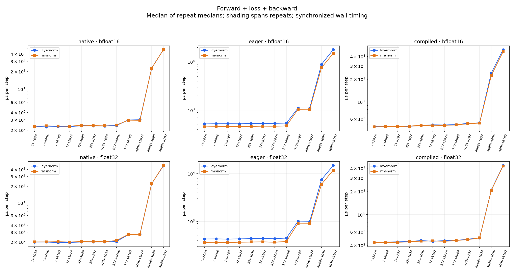
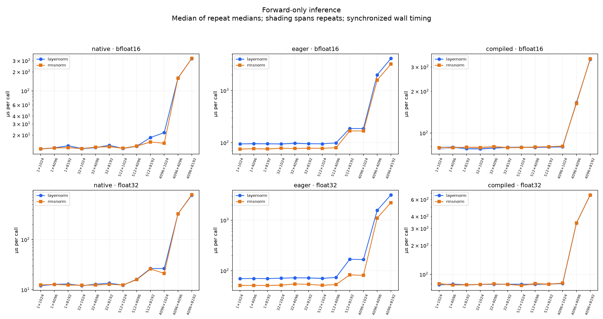
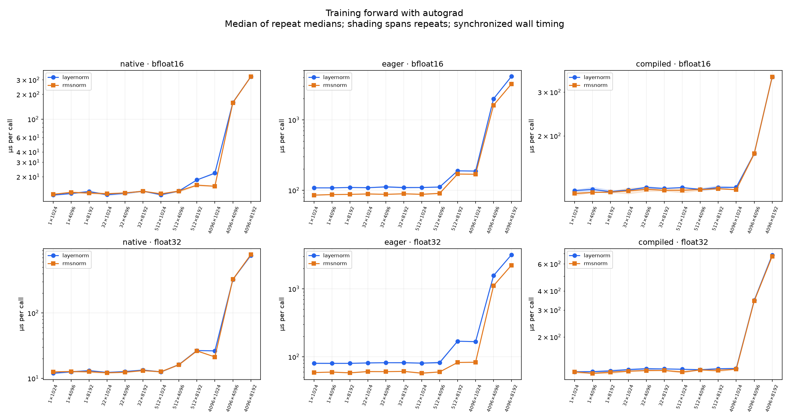
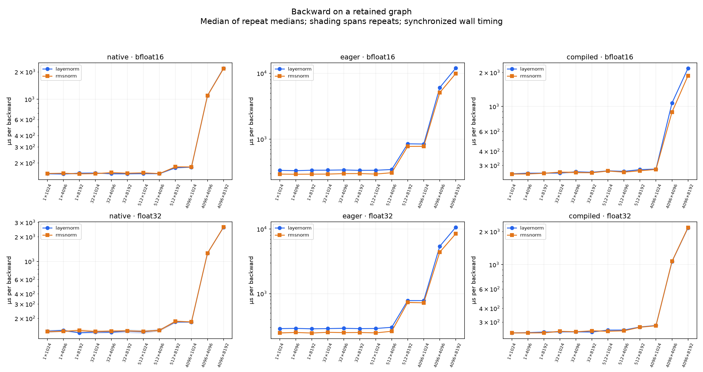
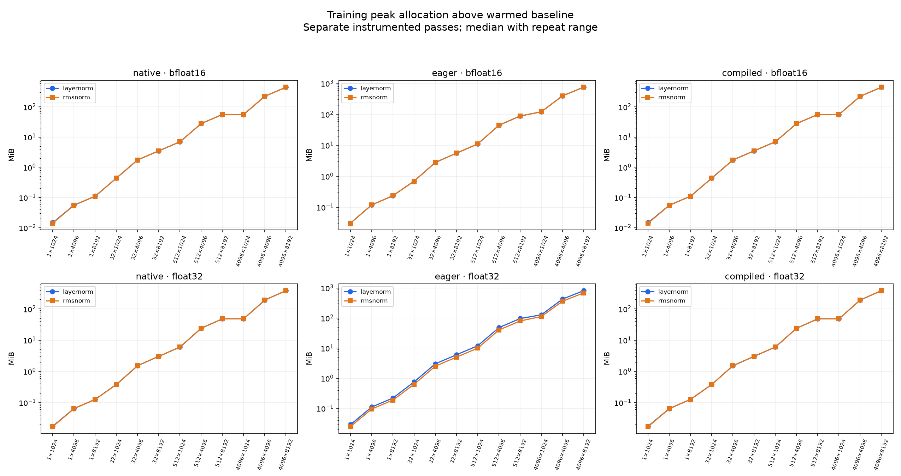
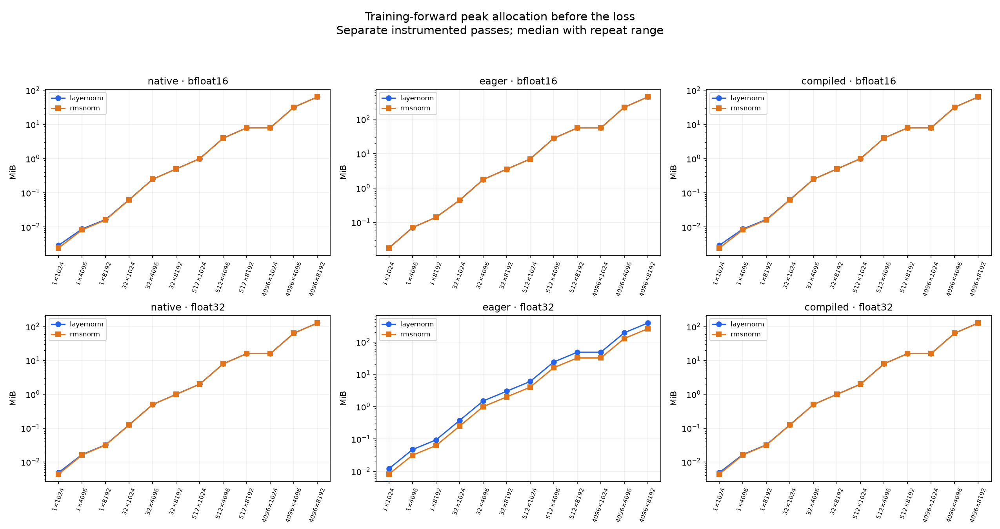
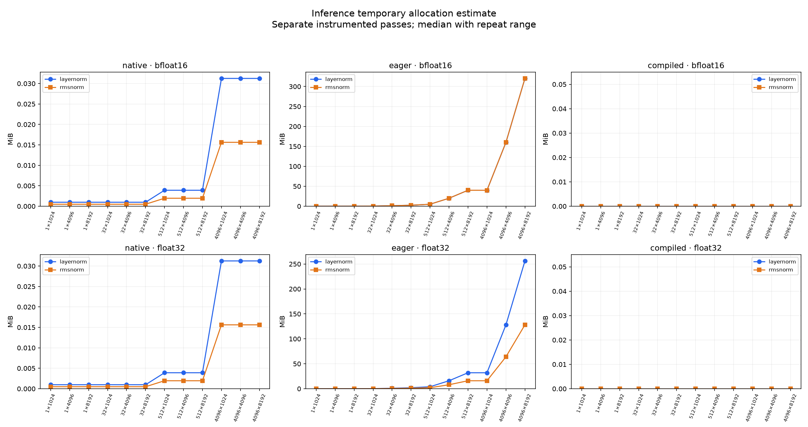
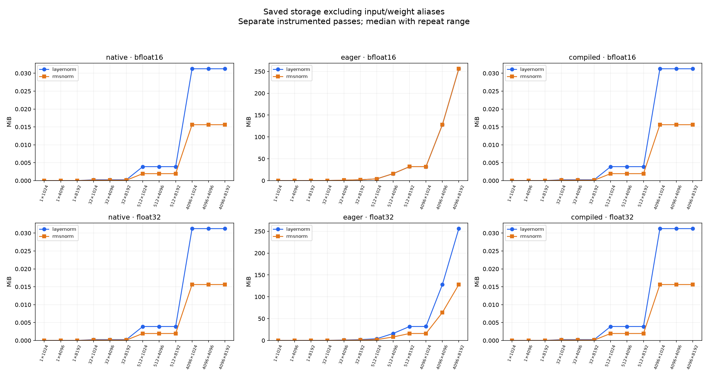
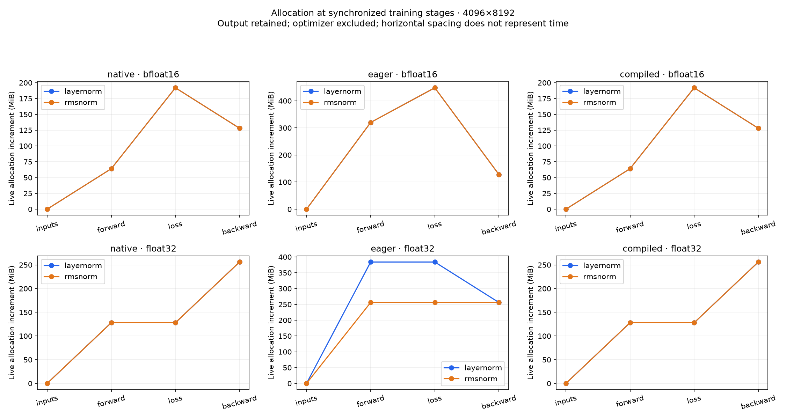

# LayerNorm versus RMSNorm: measured training baseline

288 fresh case processes; 2 repeats per configuration; 1,440,140 timed blocks; 51,305,932 calls. Measured wall batches: 63.67 minutes; total elapsed: 177.58 minutes.

Every mode has at least 1,000 samples AND 3.0 wall seconds per process. Each sample is a fixed calibrated batch; medians and p95 describe batch averages, not individual-request tails.

Bias-free, learned scale, fixed epsilon, no residual. Native kernels and FP32 eager/compiled formulas are separate families. Forward values and input/weight gradients pass each norm's own FP64 oracle. Saved-tensor hooks and allocator snapshots run after timing.

| Family | Dtype | Full-step RMSNorm speedup over LayerNorm, min–max across shapes | RMSNorm faster shapes |
|---|---|---:|---:|
| native | bfloat16 | 0.960–1.022× | 5/12 |
| native | float32 | 0.959–1.011× | 2/12 |
| eager | bfloat16 | 1.062–1.199× | 12/12 |
| eager | float32 | 1.101–1.254× | 12/12 |
| compiled | bfloat16 | 0.994–1.079× | 9/12 |
| compiled | float32 | 0.990–1.020× | 11/12 |

Ratios above 1 favor RMSNorm. Faster-shape counts describe observed medians, not statistical significance; small differences may be within process-repeat variation. Each panel uses its own vertical scale; compare the two norms within a panel.

[SVG](full-step.svg)

[SVG](inference.svg)

[SVG](training-forward.svg)

[SVG](backward.svg)

[SVG](training-peak.svg)

[SVG](forward-peak.svg)

[SVG](inference-temporary.svg)

[SVG](saved-activations.svg)

[SVG](allocation-stages.svg)

[Timing CSV](timings.csv) · [Memory CSV](memory.csv) · [Audited summaries](summary.json)

## Interpretation limits

CUDA-event intervals include launch starvation during ordinary Python calls; they are not graph-replay kernel latency. The primary wall interval includes event recording and end synchronization, amortized over each calibrated batch. Backward-only repeats reuse a retained graph; full-step builds a fresh graph and clears gradients to None on every call. Full-step includes the fixed weighted-sum loss and excludes optimizer updates. Compiler buffer donation is set to False to support graph reuse; this also constrains compiled full-step and memory results relative to default compiler optimization.

Allocator-visible bytes are not DRAM traffic or process-wide GPU usage. The warmed baseline includes inputs, weight, upstream gradients and any live runtime buffers; absolute baseline, current and peak values can be recovered from the summaries. Saved-storage metadata deduplicates aliases and excludes input/weight storage from the additional-storage figure; it excludes the loss's saved tensors. Stage snapshots include the loss, output and gradient allocations. The common FP32 weighted-sum loss can dominate the full-step peak, especially with BF16 outputs; use the training-forward peak before loss and saved-storage figures to isolate normalization overhead. Stage positions are not elapsed-time measurements. External CUDA allocations may be invisible.

The 2 process repeat(s) per case characterize this session, not cross-day stability. Compilation and checks are excluded from warmed timings; first-call records may use persistent compiler caches. Reused buffers, unlocked GPU clocks, display activity and other host activity limit generalization. Numerical comparisons do not establish equal model quality or drop-in interchangeability.

Actual DRAM-traffic counters and detailed allocation-lifetime traces remain separate future profiling work. This result covers timing, allocator peaks, saved storage and synchronized allocation stages.
